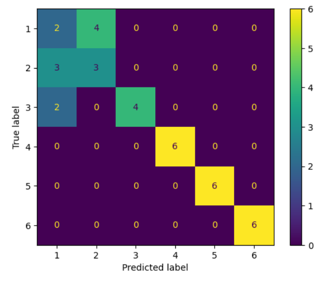

## Answer to Question 7  

### Confusion Matrix

As we can see from the confusion matrix displayed above, the model is able to very well differentiate between static and dynamic activites and is also able to classify each of the static activities with good accuracy. However the model is very confused between the dynamic activities. This is expected as walking, walking-upstairs and walking-downstairs have very simiar plots. This trend is also observed in the deploymest phase.  